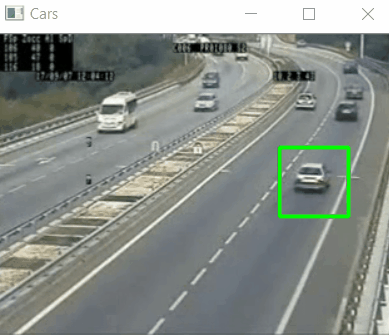

# Pedestrian / Car Vanilla detector
### In this project we detect the full body of pedestrians and Cars on an expressway using cv2.CascadeClassifier
Outputs:
1. Pedestrian Detector:
  

2. Car Detector:
  

It can be noticed that the model is not doing a great job but is decent at best. A better self-trained model will be posted soon :)
